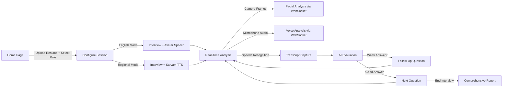

<div align="center">

# 🧠 ImprovYu — Client-Side Multimodal Assessment Network

### _Next-Gen AI-Powered Interview Intelligence Platform_

[](https://reactjs.org/)
[](https://typescriptlang.org/)
[](https://fastapi.tiangolo.com/)
[](https://expressjs.com/)
[](https://socket.io/)
[](https://ai.google.dev/)
[](https://groq.com/)
[](LICENSE)

<br/>

**ImprovYu** is a full-stack, multimodal AI interview preparation platform that performs **real-time facial expression analysis**, **voice analytics**, and **AI-driven question generation & evaluation** — all running client-side with WebSocket-powered live feedback. It supports both **English** and **10 Indian regional languages** via Sarvam AI, and includes a suite of career tools like ATS Resume Checker, Salary Estimator, and more.

<br/>

[🚀 Quick Start](#-quick-start) •
[✨ Features](#-features) •
[🏗️ Architecture](#️-architecture) •
[📡 API Reference](#-api-reference) •
[🛠️ Configuration](#️-configuration) •
[🚢 Deployment](#-deployment)

</div>

---

## 📑 Table of Contents

- [Features](#-features)
- [Architecture](#️-architecture)
- [Tech Stack](#-tech-stack)
- [Project Structure](#-project-structure)
- [Quick Start](#-quick-start)
- [Environment Variables](#️-configuration)
- [Frontend](#-frontend)
- [Backend](#-backend-api)
- [AI Services](#-ai-services)
- [Career Tools](#-career-tools)
- [Sarvam AI Integration](#-sarvam-ai--indian-regional-languages)
- [WebSocket Communication](#-websocket-communication)
- [API Reference](#-api-reference)
- [Deployment](#-deployment)
- [License](#-license)

---

## ✨ Features

### 🎯 Core Interview Experience

| Feature | Description |
|---------|-------------|
| **Real-Time Facial Analysis** | OpenCV Haar cascades detect faces/eyes and compute confidence, engagement, eye contact, and emotion scores from webcam frames |
| **Voice Analytics** | Spectral analysis extracts pitch, jitter, shimmer, pace, clarity, and emotional tone from live microphone audio |
| **AI Question Generation** | Gemini & Groq LLMs generate contextual, resume-aware questions across behavioral, technical, situational, and DSA categories |
| **AI Answer Evaluation** | Responses scored on relevance, depth, structure, and communication with detailed written feedback |
| **Follow-Up Questions** | Detects weak/absurd answers and automatically generates probing follow-ups |
| **Comprehensive Reports** | AI-generated post-interview reports with overall score, placement likelihood, skill breakdown, strengths, and recommendations |
| **3D Animated Avatar** | Three.js-powered lip-sync avatar speaks questions aloud using Web Speech API (English mode) |
| **Live Analysis Dashboard** | Real-time performance metrics, trends, and feedback displayed during the interview |
| **Resume Upload & Parsing** | PDF/DOCX parsing extracts skills, experience, and projects to personalize the interview |

### 🌐 Multilingual Support (Sarvam AI)

| Feature | Description |
|---------|-------------|
| **10 Indian Languages** | Hindi, Marathi, Tamil, Telugu, Kannada, Bengali, Gujarati, Malayalam, Punjabi, Odia |
| **Text-to-Speech (TTS)** | Bulbul v3 model converts questions to natural speech in regional languages |
| **Speech-to-Text (STT)** | Saarika v2.5 model transcribes spoken regional language answers |
| **Translation** | Mayura v1 translates between English and Indian languages |
| **Transliteration** | Script conversion between language scripts (e.g., Devanagari ↔ Latin) |
| **Language Detection** | Auto-detects the language of input text |

### 🧰 Career Tools Suite

| Tool | Description |
|------|-------------|
| **ATS Resume Checker** | Score your resume against a job description for ATS compatibility — keyword match, formatting, and suggestions |
| **Resume Enhancer** | AI rewrites bullet points with stronger action verbs, quantified impact, and role-targeted language |
| **Mock Q&A Generator** | Generates mock interview questions with model answers for any role and difficulty |
| **Salary Estimator** | AI-powered salary range estimates based on role, experience, location, and skills |

### 🎨 Premium UI/UX

- Dark glassmorphic design with `#050505` base
- 3D animated background (React Three Fiber)
- Framer Motion micro-animations and magnetic buttons
- Fully responsive across devices
- Intro splash animation on load
- Google Fonts (Outfit) typography

---

## 🏗️ Architecture

```
┌─────────────────────────────────────────────────────────────┐
│                          CLIENT                             │
│                                                             │
│  React 18 + TypeScript + MUI + Three.js + Framer Motion     │
│                                                             │
│  ┌────────────┐  ┌───────────────────┐  ┌───────────────┐   │
│  │   Home     │  │ Interview Session │  │   Report      │   │
│  │  (3D BG)   │  │ (Webcam + Mic +   │  │ (AI-generated │   │
│  │  Resume    │  │  Avatar + Live    │  │  scores &     │   │
│  │  Upload    │  │  Analysis)        │  │  feedback)    │   │
│  └────────────┘  └───────────────────┘  └───────────────┘   │
│                                                             │
│  ┌─────────────────────────────────────────────────────┐    │
│  │               Career Tools Suite                    │    │
│  │  ATS Checker │ Resume Enhancer │ Mock QA │ Salary   │    │
│  │  Translate │ TTS │ STT │ Transliterate │ Detect     │    │
│  └─────────────────────────────────────────────────────┘    │
└────────────┬──────────────────────┬─────────────────────────┘
      Socket.IO                REST + WebSocket
             │                      │
┌────────────▼──────────┐ ┌─────────▼─────────────────────────┐
│    BACKEND API        │ │         AI SERVICES                │
│    (Express.js)       │ │         (FastAPI)                  │
│                       │ │                                    │
│  • Session management │ │  • Facial Analyzer (OpenCV)        │
│  • Question routing   │ │  • Voice Analyzer (NumPy)          │
│  • Answer evaluation  │ │  • Gemini Client (Google AI)       │
│  • Health monitoring  │ │  • Groq Client (LPU Inference)     │
│  • Fallback logic     │ │  • Sarvam AI Router                │
│                       │ │  • Career Tools Router             │
│  Port: 5000           │ │  • WebSocket Live Analysis         │
│                       │ │  • Resume Upload & Parsing         │
└───────────────────────┘ │                                    │
                          │  Port: 8001                        │
                          └────────────────────────────────────┘
                                       │
               ┌───────────────────────┼───────────────────────┐
               │                       │                       │
        ┌──────▼──────┐   ┌────────────▼───┐   ┌──────────────▼──┐
        │  Google     │   │   Groq         │   │   Sarvam AI     │
        │  Gemini API │   │   (Llama 3)    │   │   (Indian NLP)  │
        └─────────────┘   └────────────────┘   └─────────────────┘
```

---

## 🔧 Tech Stack

### Frontend
| Technology | Purpose |
|------------|---------|
| **React 18** | UI framework with hooks and lazy loading |
| **TypeScript** | Type-safe development |
| **Material UI 5** | Component library (dark theme) |
| **Three.js + R3F** | 3D animated avatar and background |
| **Framer Motion** | Page transitions and micro-animations |
| **react-webcam** | Browser webcam capture |
| **Socket.IO Client** | Real-time bidirectional communication |
| **Chart.js** | Performance visualization charts |
| **Axios** | HTTP client for API calls |
| **react-dropzone** | Drag-and-drop resume upload |
| **pdfjs-dist / mammoth** | PDF and DOCX parsing |
| **Lucide React** | Modern icon set |
| **uuid** | Session ID generation |

### Backend
| Technology | Purpose |
|------------|---------|
| **Express.js 4** | HTTP server and REST API |
| **Socket.IO** | Real-time session communication |
| **Helmet** | HTTP security headers |
| **CORS** | Cross-origin resource sharing |
| **Morgan** | HTTP request logging |
| **express-rate-limit** | API rate limiting |
| **Mongoose** | MongoDB ODM (database layer) |
| **jsonwebtoken** | JWT authentication |
| **bcryptjs** | Password hashing |
| **Multer** | File upload middleware |
| **pdf-parse / mammoth** | Resume document parsing |
| **Joi** | Request validation |

### AI Services
| Technology | Purpose |
|------------|---------|
| **FastAPI** | Async Python web framework |
| **Uvicorn** | ASGI server with WebSocket support |
| **OpenCV** | Haar cascade face/eye detection |
| **NumPy** | Numerical audio/image processing |
| **Pillow** | Image handling and transformation |
| **google-genai** | Google Gemini API client |
| **groq** | Groq LPU inference client |
| **Pydantic** | Request/response validation |
| **python-dotenv** | Environment variable management |
| **requests** | HTTP calls to Sarvam AI API |

---

## 📂 Project Structure

```
Client-side-Multimodal-Assessment-Network/
├── package.json                 # Root monorepo config (npm workspaces)
├── start-app.ps1                # PowerShell script to start all 3 services
├── .gitignore
│
├── frontend/                    # React TypeScript Application
│   ├── package.json
│   ├── tsconfig.json
│   ├── .env                     # REACT_APP_AI_SERVICE_URL, REACT_APP_BACKEND_URL
│   ├── .env.example
│   ├── server.js                # Production static file server
│   ├── railway.json             # Railway deployment config
│   ├── vercel.json              # Vercel deployment config
│   ├── public/
│   │   └── index.html
│   └── src/
│       ├── App.tsx              # Root component with routing
│       ├── App.css              # Global styles
│       ├── index.tsx            # Entry point
│       ├── index.css            # Base CSS reset
│       ├── theme/
│       │   └── index.ts         # MUI dark theme configuration
│       ├── types/
│       │   ├── index.ts         # TypeScript interfaces (InterviewScore, etc.)
│       │   └── speech-recognition.d.ts  # Web Speech API type declarations
│       ├── services/
│       │   ├── SocketIOService.ts    # Socket.IO client wrapper
│       │   └── WebSocketService.ts   # WebSocket client for live analysis
│       └── components/
│           ├── Home.tsx                  # Landing page (3D background, resume upload, language select)
│           ├── EnhancedInterviewSession.tsx  # Main interview UI (webcam, mic, avatar, live analysis)
│           ├── InterviewReport.tsx       # Post-interview AI-generated report
│           ├── IntroAnimation.tsx        # Splash screen animation
│           ├── NavigationHeader.tsx      # Global navigation bar
│           ├── Settings.tsx             # Settings page
│           ├── Dashboard.tsx            # Dashboard overview
│           ├── ResumeUpload.tsx         # Drag-and-drop resume upload component
│           ├── Avatar3D.tsx             # Three.js 3D avatar model
│           ├── LipSyncAvatar.tsx        # Lip-sync animated talking avatar
│           ├── LiveAnalysisDisplay.tsx  # Real-time facial/voice metrics display
│           ├── home/
│           │   └── AnimatedBackground.tsx  # React Three Fiber 3D background
│           └── tools/
│               ├── ToolsPage.tsx         # Career tools hub page
│               ├── ATSCheckerTool.tsx     # ATS resume checker UI
│               ├── ResumeEnhancerTool.tsx # Resume enhancer UI
│               ├── MockQATool.tsx         # Mock Q&A generator UI
│               ├── SalaryEstimatorTool.tsx # Salary estimator UI
│               ├── TranslateTool.tsx      # Text translation UI
│               ├── TextToSpeechTool.tsx   # Text-to-speech UI
│               ├── SpeechToTextTool.tsx   # Speech-to-text UI
│               ├── TransliterateTool.tsx  # Transliteration UI
│               └── LanguageDetectTool.tsx # Language detection UI
│
├── backend/                     # Express.js API Server
│   ├── package.json
│   ├── .env                     # PORT, AI_SERVICE_URL
│   └── src/
│       └── index.js             # All routes, Socket.IO handlers, session management
│
└── ai-services/                 # FastAPI AI Microservice
    ├── main.py                  # FastAPI app, WebSocket endpoints, router registration
    ├── routes.py                # Core AI routes (facial, voice, question gen, evaluation, reports)
    ├── sarvam_routes.py         # Sarvam AI tools (translate, TTS, STT, transliterate, detect)
    ├── career_tools_routes.py   # Career tools (ATS checker, resume enhancer, mock QA, salary)
    ├── requirements.txt         # Python dependencies
    ├── .env                     # GOOGLE_API_KEY, GROQ_API_KEY, SARVAM_API_KEY, AI_SVC_PORT
    ├── Procfile                 # Railway/Heroku process definition
    ├── railway.json             # Railway deployment config
    ├── facial-analysis/         # Facial analysis utilities
    ├── voice-analysis/          # Voice analysis utilities
    └── gemini-integration/      # Gemini integration utilities
```

---

## 🚀 Quick Start

### Prerequisites

- **Node.js** ≥ 18.x and **npm** ≥ 9.x
- **Python** ≥ 3.9
- **pip** (Python package manager)
- API keys for **Google Gemini**, **Groq**, and **Sarvam AI** (see [Configuration](#️-configuration))

### 1. Clone the Repository

```bash
git clone https://github.com/RAJ-MANE/MODEL_FORGE.git
cd Client-side-Multimodal-Assessment-Network
```

### 2. Install Dependencies

```bash
# Install frontend + backend dependencies (npm workspaces)
npm install

# Install AI services Python dependencies
cd ai-services
pip install -r requirements.txt
cd ..
```

### 3. Configure Environment Variables

Create `.env` files in each service directory (see [Configuration](#️-configuration) below).

### 4. Start All Services

**Option A — PowerShell script (recommended on Windows):**
```powershell
.\start-app.ps1
```

**Option B — Manual startup (3 separate terminals):**

```bash
# Terminal 1: Backend (port 5000)
cd backend
npm start

# Terminal 2: AI Services (port 8001)
cd ai-services
python main.py

# Terminal 3: Frontend (port 3000)
cd frontend
npm start
```

### 5. Open the Application

Navigate to **http://localhost:3000** in your browser.

---

## 🛠️ Configuration

### Frontend (`frontend/.env`)

```env
REACT_APP_AI_SERVICE_URL=http://localhost:8001
REACT_APP_BACKEND_URL=http://localhost:5000
```

### Backend (`backend/.env`)

```env
PORT=5000
AI_SERVICE_URL=http://localhost:8001
```

### AI Services (`ai-services/.env`)

```env
GOOGLE_API_KEY=your-google-gemini-api-key
GROQ_API_KEY=your-groq-api-key
SARVAM_API_KEY=your-sarvam-api-key
AI_SVC_PORT=8001
```

> **🔑 Getting API Keys:**
> - **Google Gemini**: [Google AI Studio](https://aistudio.google.com/apikey)
> - **Groq**: [Groq Console](https://console.groq.com/keys)
> - **Sarvam AI**: [Sarvam Dashboard](https://dashboard.sarvam.ai/)

---

## 🖥️ Frontend

### Pages & Routing

| Route | Component | Description |
|-------|-----------|-------------|
| `/` | `Home` | Landing page with 3D animated background, feature showcase, resume upload, job role input, language selector, and dual-mode interview launch (English / Regional) |
| `/interview/:sessionId` | `EnhancedInterviewSession` | Full interview experience with webcam, microphone, 3D lip-sync avatar, real-time analysis dashboard, and speech recognition |
| `/report/:sessionId` | `InterviewReport` | AI-generated comprehensive performance report with scores, skill breakdown, and recommendations |
| `/settings` | `Settings` | Application settings page |
| `/tools` | `ToolsPage` | Career tools hub with cards linking to each tool |
| `/tools/ats-checker` | `ATSCheckerTool` | ATS resume checker interface |
| `/tools/resume-enhancer` | `ResumeEnhancerTool` | Resume enhancer interface |
| `/tools/mock-qa` | `MockQATool` | Mock Q&A generator interface |
| `/tools/salary-estimator` | `SalaryEstimatorTool` | Salary estimator interface |

### Interview Session Flow



### Key Frontend Components

- **`EnhancedInterviewSession`** — The heart of the app. Manages webcam capture, microphone recording, Web Speech API recognition, real-time WebSocket communication for live analysis, question generation, answer evaluation, follow-up question detection, and scoring.
- **`LipSyncAvatar`** — Three.js 3D avatar with lip-sync animation that speaks interview questions aloud (English mode only). Disabled in regional mode to prevent voice overlap with Sarvam TTS.
- **`LiveAnalysisDisplay`** — Visualizes real-time confidence, engagement, eye contact, and voice metrics with trend indicators.
- **`ResumeUpload`** — Drag-and-drop component parsing PDF (via pdfjs-dist) and DOCX (via mammoth) files, extracting skills, experience, and projects.
- **`AnimatedBackground`** — React Three Fiber 3D particle/geometry animation on the home page.

---

## ⚙️ Backend API

The backend is a single-file Express.js server (`backend/src/index.js`) that handles:

### REST Endpoints

| Method | Endpoint | Description |
|--------|----------|-------------|
| `GET` | `/` | API status check |
| `GET` | `/health` | Health check (includes AI services connectivity status) |

### Socket.IO Events

| Event | Direction | Description |
|-------|-----------|-------------|
| `join-session` | Client → Server | Join an interview session room |
| `session-joined` | Server → Client | Confirmation with participant count |
| `request-question` | Client → Server | Request a new interview question (with job role, resume data, difficulty, category) |
| `question-generated` | Server → Client | Generated question with metadata |
| `submit-response` | Client → Server | Submit an answer with transcript and duration |
| `response-evaluated` | Server → Client | AI evaluation with score and feedback |
| `end-session` | Client → Server | End the interview session |
| `error` | Server → Client | Error notification |

### Session Management

The backend maintains an in-memory `activeSessions` Map tracking:
- Participant connections
- Question history (to avoid repetition)
- Response history
- Job role and resume data
- Question count and scores

### AI Failover Strategy

The backend implements graceful degradation:
1. **Primary**: Calls AI Services (FastAPI) for question generation and evaluation
2. **Fallback**: Uses built-in question banks and heuristic evaluation if AI services are unavailable

---

## 🤖 AI Services

### Core Modules (`routes.py`)

#### `RealFacialAnalyzer`
Real-time facial expression analysis using OpenCV Haar cascades.

| Metric | Description |
|--------|-------------|
| **Confidence** | Calculated from facial posture, symmetry, and expression stability |
| **Engagement** | Derived from facial activity and attention cues |
| **Eye Contact** | Gaze direction estimation using eye position within face bounds |
| **Emotions** | Detects happy, sad, surprised, angry, neutral, and focused states |

#### `RealVoiceAnalyzer`
Spectral audio analysis for voice quality assessment.

| Metric | Description |
|--------|-------------|
| **Pitch** | Fundamental frequency analysis |
| **Jitter** | Voice frequency perturbation (steadiness) |
| **Shimmer** | Amplitude perturbation (consistency) |
| **Pace** | Speaking rate (words-per-minute estimation) |
| **Clarity** | Combined ZCR, spectral centroid, and jitter score |
| **Confidence** | Derived from voice stability and energy |
| **Emotions** | Calm, excited, nervous, confident, neutral |

#### `RealGeminiClient`
Google Gemini AI integration with multi-provider failover.

| Feature | Description |
|---------|-------------|
| **Question Generation** | Resume-aware, role-specific questions with difficulty scaling |
| **Answer Evaluation** | Scores on relevance, depth, structure, communication with written feedback |
| **Interview Reports** | Comprehensive post-interview analysis with overall score, placement likelihood, skill breakdown |
| **Comprehensive Evaluation** | Full conversation history analysis for nuanced assessment |
| **Failover** | Groq first → Gemini fallback → local generation |

#### `RealGroqClient`
Groq LPU inference for ultra-fast question generation and answer evaluation using Llama 3.

#### `ConnectionManager`
WebSocket connection manager for real-time live analysis.

| Feature | Description |
|---------|-------------|
| **Session Tracking** | Manages active WebSocket connections per session |
| **Trend Calculation** | Computes performance trends over recent analyses |
| **Real-Time Feedback** | Generates contextual coaching tips based on current performance |
| **Voice Trends** | Tracks voice quality metrics over time |
| **Speaking Stats** | Calculates speaking time and activity statistics |

### REST API Endpoints

| Method | Endpoint | Description |
|--------|----------|-------------|
| `GET` | `/` | Service status |
| `GET` | `/health` | Health check |
| `POST` | `/api/analyze/facial` | Analyze facial expression from base64 image |
| `POST` | `/api/analyze/voice` | Analyze voice from base64 audio |
| `POST` | `/api/generate/question` | Generate interview question |
| `POST` | `/api/generate/follow-up` | Generate follow-up question after weak answer |
| `POST` | `/api/evaluate/answer` | Evaluate interview answer |
| `POST` | `/api/report/generate` | Generate comprehensive interview report |
| `POST` | `/api/report/comprehensive-evaluation` | Generate evaluation from full conversation |
| `POST` | `/api/upload/resume` | Upload and parse resume file |
| `GET` | `/api/session/{session_id}/summary` | Get analysis summary for a session |

### WebSocket Endpoint

| Endpoint | Description |
|----------|-------------|
| `ws://localhost:8001/ws/live-analysis/{session_id}` | Real-time bidirectional analysis (send video/audio frames, receive analysis results) |
| `ws://localhost:8001/ws/test` | WebSocket connectivity test (echo) |

---

## 🧰 Career Tools

### API Endpoints (`/api/tools/`)

| Method | Endpoint | Request Body | Description |
|--------|----------|-------------|-------------|
| `POST` | `/api/tools/ats-check` | `{ resume_text, job_description }` | ATS compatibility score with keyword analysis |
| `POST` | `/api/tools/resume-enhance` | `{ resume_text, target_role? }` | Enhanced resume with stronger language |
| `POST` | `/api/tools/mock-qa` | `{ job_role, difficulty?, count? }` | Generated Q&A pairs with model answers |
| `POST` | `/api/tools/salary-estimate` | `{ job_role, experience_years?, location?, skills? }` | Salary range estimate |

---

## 🇮🇳 Sarvam AI — Indian Regional Languages

### Supported Languages

| Code | Language |
|------|----------|
| `hi-IN` | Hindi |
| `mr-IN` | Marathi |
| `ta-IN` | Tamil |
| `te-IN` | Telugu |
| `kn-IN` | Kannada |
| `bn-IN` | Bengali |
| `gu-IN` | Gujarati |
| `ml-IN` | Malayalam |
| `pa-IN` | Punjabi |
| `od-IN` | Odia |

### API Endpoints (`/api/tools/`)

| Method | Endpoint | Description | Model |
|--------|----------|-------------|-------|
| `GET` | `/api/tools/languages` | List all supported languages | — |
| `POST` | `/api/tools/translate` | Translate text between languages | Mayura v1 |
| `POST` | `/api/tools/tts` | Convert text to speech audio | Bulbul v3 |
| `POST` | `/api/tools/stt` | Transcribe speech audio to text | Saarika v2.5 |
| `POST` | `/api/tools/transliterate` | Convert text between scripts | — |
| `POST` | `/api/tools/detect-language` | Detect language of input text | — |
| `POST` | `/api/tools/speak-question` | TTS for interview questions (auto-translates if needed) | Bulbul v3 |

---

## 🔌 WebSocket Communication

### Live Analysis Flow

```
Client (Browser)                    AI Services (FastAPI)
      │                                     │
      │  Connect: /ws/live-analysis/{id}    │
      │────────────────────────────────────▶│
      │          Connection Accepted        │
      │◀────────────────────────────────────│
      │                                     │
      │  Send: { type: "facial",            │
      │          image_data: "base64..." }  │
      │────────────────────────────────────▶│
      │                                     │ ──▶ RealFacialAnalyzer
      │  Receive: { confidence: 85,         │
      │            engagement: 72,          │
      │            eye_contact: 90,         │
      │            emotions: {...},         │
      │            trends: {...},           │
      │            feedback: [...] }        │
      │◀────────────────────────────────────│
      │                                     │
      │  Send: { type: "voice",             │
      │          audio_data: "base64..." }  │
      │────────────────────────────────────▶│
      │                                     │ ──▶ RealVoiceAnalyzer
      │  Receive: { pitch: 165,             │
      │            pace: "moderate",        │
      │            clarity: 78,             │
      │            voice_confidence: 82 }   │
      │◀────────────────────────────────────│
```

### Socket.IO Interview Flow

```
Client (Browser)                    Backend (Express.js)               AI Services
      │                                     │                              │
      │  join-session(sessionId)            │                              │
      │────────────────────────────────────▶│                              │
      │  session-joined                     │                              │
      │◀────────────────────────────────────│                              │
      │                                     │                              │
      │  request-question(role, resume)     │                              │
      │────────────────────────────────────▶│  POST /api/generate/question │
      │                                     │─────────────────────────────▶│
      │                                     │  { question, category, ... } │
      │  question-generated                 │◀─────────────────────────────│
      │◀────────────────────────────────────│                              │
      │                                     │                              │
      │  submit-response(answer, duration)  │                              │
      │────────────────────────────────────▶│  POST /api/evaluate/answer   │
      │                                     │─────────────────────────────▶│
      │                                     │  { score, feedback, ... }    │
      │  response-evaluated                 │◀─────────────────────────────│
      │◀────────────────────────────────────│                              │
```

---

## 🚢 Deployment

### Railway

Both the **frontend** and **ai-services** include `railway.json` configuration files:

**Frontend (`frontend/railway.json`):**
```json
{
  "$schema": "https://railway.com/railway.schema.json",
  "build": { "builder": "NIXPACKS" },
  "deploy": {
    "startCommand": "npm run serve",
    "healthcheckPath": "/",
    "restartPolicyType": "ON_FAILURE"
  }
}
```

**AI Services (`ai-services/railway.json`):**
```json
{
  "$schema": "https://railway.com/railway.schema.json",
  "build": { "builder": "NIXPACKS" },
  "deploy": {
    "startCommand": "uvicorn main:app --host 0.0.0.0 --port $PORT",
    "healthcheckPath": "/health",
    "restartPolicyType": "ON_FAILURE"
  }
}
```

### Vercel

Frontend includes `vercel.json` for SPA routing:

```json
{
  "rewrites": [{ "source": "/(.*)", "destination": "/index.html" }]
}
```

### Heroku/Railway (AI Services)

```
# Procfile
web: uvicorn main:app --host 0.0.0.0 --port $PORT
```

---

## 📊 Interview Scoring System

### Question Categories (by progression)

| Question # | Category |
|-----------|----------|
| 1 | Introduction / Behavioral |
| 2 | Strengths & Skills |
| 3–4 | Technical |
| 5 | Problem Solving |
| 6 | Situational / Case Study |
| 7 | DSA / Analytical |
| 8 | Behavioral (Teamwork) |
| 9 | Technical Deep-Dive |
| 10 | Career Goals & Wrap-Up |

### Difficulty Scaling

| Question # | Difficulty |
|-----------|------------|
| 1–3 | Medium |
| 4–6 | Medium–Hard |
| 7+ | Hard |

### Scoring Breakdown

Each response is scored (0–100) based on:
- **Relevance** to the question asked
- **Depth** of the answer
- **Structure** and logical organization
- **Communication** quality (clarity, confidence)
- **Response time** (penalizes very fast or very slow answers)
- **Facial analysis** (engagement, confidence, eye contact)
- **Voice analysis** (clarity, pace, tone)

### Report Metrics

| Metric | Description |
|--------|-------------|
| **Overall Score** | Weighted composite (0–100) |
| **Placement Likelihood** | High / Medium / Low / Very Low |
| **Verbal Communication** | Speech quality and articulation |
| **Confidence Level** | Body language and voice steadiness |
| **Technical Competency** | Domain knowledge accuracy |
| **Problem Solving** | Analytical approach quality |
| **Professionalism** | Demeanor and presentation |
| **Strengths** | AI-identified strong areas |
| **Development Areas** | Areas needing improvement |
| **Recommendations** | Actionable improvement suggestions |

---

## 🧪 Development

### Running individual services

```bash
# Frontend dev server (hot reload)
cd frontend && npm start

# Backend dev server (with nodemon)
cd backend && npm run dev

# AI Services (auto-reload with uvicorn)
cd ai-services && uvicorn main:app --reload --port 8001
```

### Building for production

```bash
# Build frontend
cd frontend && npm run build

# Serve production frontend
cd frontend && npm run serve
```

---

## 📝 License

This project is licensed under the **MIT License**.

---

<div align="center">

**Built with ❤️ by [Raj Mane](https://github.com/RAJ-MANE)**

_ImprovYu — Elevate Your Interview Performance_

</div>